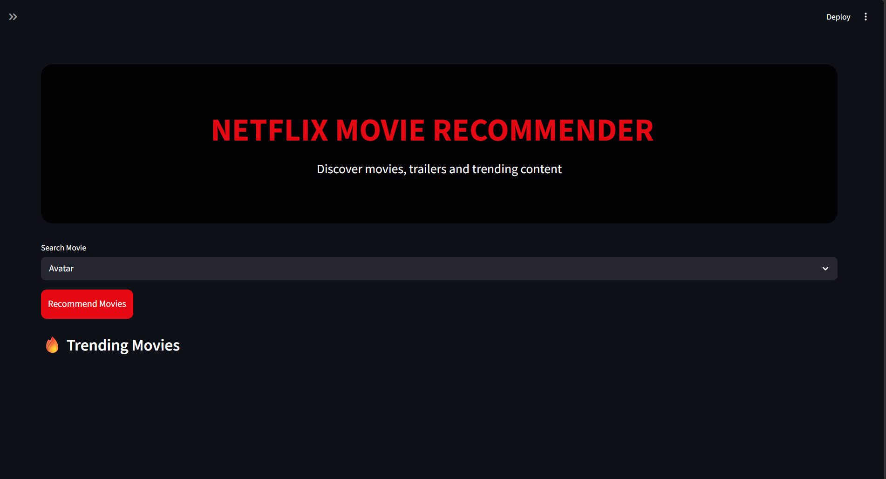
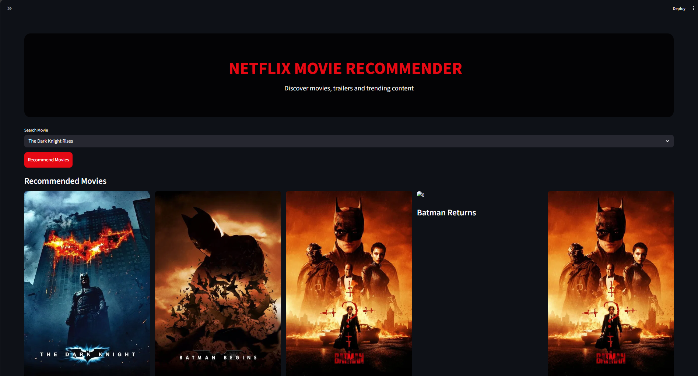
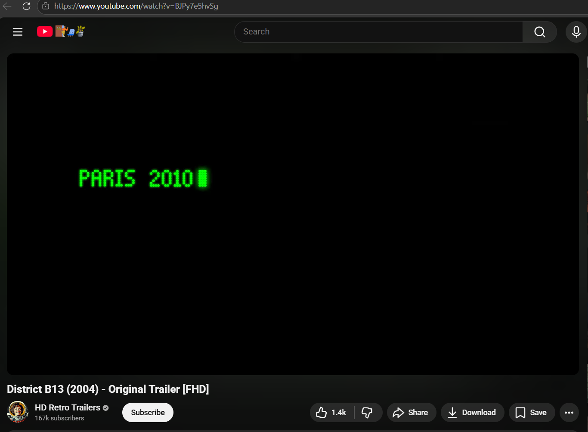
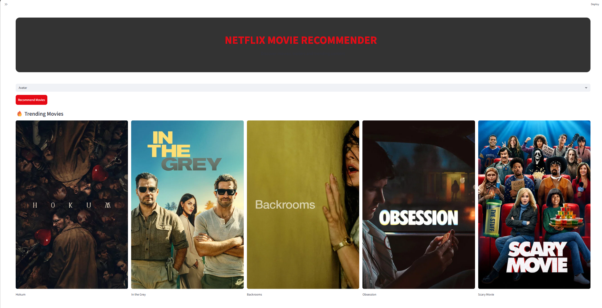

# 🎬 Netflix Movie Recommendation System

A Netflix-style movie recommendation web application built using Machine Learning and Streamlit.

---

## 🚀 Features

- Movie Recommendation Engine
- Netflix-style Dark UI
- Movie Posters
- Trailer Integration
- Trending Movies
- Genre Filtering
- Responsive Layout
- TMDB API Integration

---

## 🛠️ Technologies Used

- Python
- Streamlit
- Machine Learning
- NLP
- Scikit-learn
- Pandas
- TMDB API

---

## 📂 Project Structure

```plaintext
movie-recommender-system/
│
├── assets/
├── data/
├── models/
├── src/
├── requirements.txt
└── README.md
```

---

## ⚙️ Installation

### Clone Repository

```bash
git clone https://github.com/SUMIT122005/netflix-movie-recommender.git
```

### Install Requirements

```bash
pip install -r requirements.txt
```

### Run Preprocessing

```bash
python src/preprocess.py
```

### Run Application

```bash
streamlit run src/app.py
```

---

## 🌐 Features Included

✅ Netflix-style dark UI  
✅ Movie recommendations  
✅ Movie posters  
✅ Trailer integration  
✅ Trending movies  
✅ Genre filtering  
✅ Responsive layout  

---
## 📸 Screenshots

### Homepage



### Recommendations



### Trailer Integration



### Netflix Dark Theme


### Trending Movies



## 👨‍💻 Author

Sumit Kank